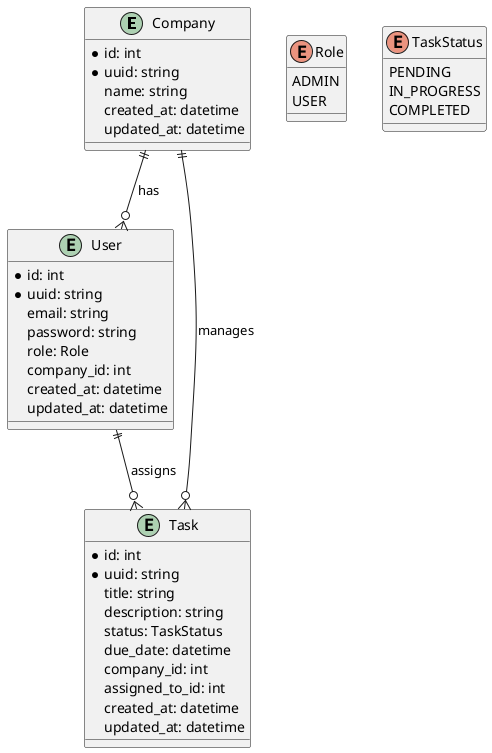

# Documentação da API

Este documento descreve as rotas disponíveis na API, detalha quais roles (papéis) têm permissão para acessá-las e indica quais rotas são públicas ou privadas. Esta documentação servirá como base para o desenvolvimento e uso da API.

## Sumário

- [Autenticação e Autorização](#autenticação-e-autorização)
- [Gestão de Empresas (Tenants)](#gestão-de-empresas-tenants)
- [Gestão de Usuários](#gestão-de-usuários)
- [Gestão de Tarefas](#gestão-de-tarefas)
- [Diagrama de Entidades](#diagrama-de-entidades)

## Autenticação e Autorização

### `POST /auth/login`

- **Descrição**: Autentica o usuário e retorna um token JWT.
- **Acesso**: **Público**
- **Permissões**: Qualquer usuário pode acessar para realizar login.

### `GET /auth/me`

- **Descrição**: Retorna as informações do usuário autenticado.
- **Acesso**: **Privado**
- **Permissões**:
  - `ADMIN`: Pode acessar.
  - `USER`: Pode acessar.

## Gestão de Empresas (Tenants)

### `POST /companies`

- **Descrição**: Cria uma nova empresa.
- **Acesso**: **Privado**
- **Permissões**:
  - `ADMIN`: Pode criar empresas.
  - `USER`: **Não tem permissão**.

### `GET /companies`

- **Descrição**: Lista todas as empresas.
- **Acesso**: **Privado**
- **Permissões**:
  - `ADMIN`: Pode listar todas as empresas.
  - `USER`: **Não tem permissão** ou pode ver apenas sua própria empresa, dependendo das regras de negócio.

### `GET /companies/:id`

- **Descrição**: Visualiza detalhes de uma empresa específica.
- **Acesso**: **Privado**
- **Permissões**:
  - `ADMIN`: Pode visualizar qualquer empresa.
  - `USER`: Pode visualizar apenas a empresa à qual está associado.

### `PUT /companies/:id`

- **Descrição**: Atualiza dados de uma empresa.
- **Acesso**: **Privado**
- **Permissões**:
  - `ADMIN`: Pode atualizar qualquer empresa.
  - `USER`: **Não tem permissão**.

### `DELETE /companies/:id`

- **Descrição**: Exclui uma empresa.
- **Acesso**: **Privado**
- **Permissões**:
  - `ADMIN`: Pode excluir empresas.
  - `USER`: **Não tem permissão**.

## Gestão de Usuários

### `POST /companies/:companyId/users`

- **Descrição**: Registra um usuário em uma empresa.
- **Acesso**: **Privado**
- **Permissões**:
  - `ADMIN`: Pode registrar usuários em qualquer empresa.
  - `USER`: **Não tem permissão**.

### `GET /companies/:companyId/users`

- **Descrição**: Lista todos os usuários de uma empresa.
- **Acesso**: **Privado**
- **Permissões**:
  - `ADMIN`: Pode listar usuários de qualquer empresa.
  - `USER`: Pode listar usuários apenas da sua própria empresa.

### `GET /companies/:companyId/users/:id`

- **Descrição**: Visualiza detalhes de um usuário específico.
- **Acesso**: **Privado**
- **Permissões**:
  - `ADMIN`: Pode visualizar qualquer usuário.
  - `USER`: Pode visualizar apenas seus próprios dados.

### `PUT /companies/:companyId/users/:id`

- **Descrição**: Atualiza dados de um usuário.
- **Acesso**: **Privado**
- **Permissões**:
  - `ADMIN`: Pode atualizar qualquer usuário.
  - `USER`: Pode atualizar apenas seus próprios dados.

### `DELETE /companies/:companyId/users/:id`

- **Descrição**: Exclui um usuário.
- **Acesso**: **Privado**
- **Permissões**:
  - `ADMIN`: Pode excluir qualquer usuário.
  - `USER`: **Não tem permissão**.

## Gestão de Tarefas

### `POST /companies/:companyId/tasks`

- **Descrição**: Cria uma nova tarefa para uma empresa.
- **Acesso**: **Privado**
- **Permissões**:
  - `ADMIN`: Pode criar tarefas em qualquer empresa.
  - `USER`: Pode criar tarefas apenas na empresa à qual está associado.

### `GET /companies/:companyId/tasks`

- **Descrição**: Lista todas as tarefas de uma empresa.
- **Acesso**: **Privado**
- **Permissões**:
  - `ADMIN`: Pode listar tarefas de qualquer empresa.
  - `USER`: Pode listar tarefas apenas da sua própria empresa.

### `GET /companies/:companyId/tasks/:id`

- **Descrição**: Visualiza detalhes de uma tarefa específica.
- **Acesso**: **Privado**
- **Permissões**:
  - `ADMIN`: Pode visualizar qualquer tarefa.
  - `USER`: Pode visualizar tarefas da sua empresa.

### `PUT /companies/:companyId/tasks/:id`

- **Descrição**: Atualiza uma tarefa.
- **Acesso**: **Privado**
- **Permissões**:
  - `ADMIN`: Pode atualizar qualquer tarefa.
  - `USER`: Pode atualizar tarefas atribuídas a si ou conforme regras da empresa.

### `DELETE /companies/:companyId/tasks/:id`

- **Descrição**: Exclui uma tarefa.
- **Acesso**: **Privado**
- **Permissões**:
  - `ADMIN`: Pode excluir qualquer tarefa.
  - `USER`: **Não tem permissão** ou conforme políticas da empresa.

## Diagrama de Entidades

**Notas:**

- **Público vs. Privado**:
  - Rotas **públicas** podem ser acessadas sem autenticação.
  - Rotas **privadas** requerem um token JWT válido para acesso.

- **Roles e Permissões**:
  - `ADMIN`: Usuário com permissões administrativas. Pode realizar operações de criação, leitura, atualização e exclusão (CRUD) em todas as entidades.
  - `USER`: Usuário comum. Permissões limitadas, geralmente restritas à empresa à qual está associado e às suas próprias informações.

- **Segurança**:
  - Todas as rotas privadas devem implementar middleware de autenticação para verificar a validade do token JWT.
  - A autorização deve ser implementada para garantir que os usuários só acessem recursos aos quais têm permissão.

# Códigos de Erro por Entidade

A seguir estão os códigos de erro organizados por entidade, incluindo seus identificadores, descrições e códigos de status HTTP correspondentes.

## Autenticação e Autorização

| CÓDIGO | IDENTIFICADOR          | DESCRIÇÃO                                                   | HTTP STATUS       |
|--------|------------------------|-------------------------------------------------------------|-------------------|
| 1000   | AUTHENTICATION_FAILED  | Credenciais inválidas. O e-mail ou senha estão incorretos.  | 401 Unauthorized  |
| 1001   | TOKEN_EXPIRED          | Token JWT expirado. Faça login novamente.                   | 401 Unauthorized  |
| 1002   | TOKEN_INVALID          | Token JWT inválido.                                         | 401 Unauthorized  |
| 1030   | SESSION_EXPIRED        | Sessão expirada. Por favor, faça login novamente.           | 401 Unauthorized  |
| 1003   | ACCESS_DENIED          | Acesso negado. Você não tem permissão para este recurso.    | 403 Forbidden     |

## Gestão de Empresas (Tenants)

| CÓDIGO | IDENTIFICADOR          | DESCRIÇÃO                                                       | HTTP STATUS       |
|--------|------------------------|-----------------------------------------------------------------|-------------------|
| 1007   | COMPANY_NOT_FOUND      | Empresa não encontrada.                                         | 404 Not Found     |
| 1020   | INVALID_UUID_FORMAT    | Formato de UUID inválido para a empresa.                        | 400 Bad Request   |
| 1006   | DUPLICATE_ENTRY        | A empresa que você está tentando criar já existe.               | 409 Conflict      |
| 1021   | COMPANY_ID_MISMATCH    | ID da empresa não corresponde ao seu.                           | 403 Forbidden     |
| 1023   | DATABASE_ERROR         | Erro no banco de dados ao acessar empresas.                     | 500 Internal Server Error |
| 1005   | VALIDATION_ERROR       | Erro de validação nos dados da empresa.                         | 400 Bad Request   |
| 1003   | ACCESS_DENIED          | Acesso negado ao gerenciar empresas.                            | 403 Forbidden     |

## Gestão de Usuários

| CÓDIGO | IDENTIFICADOR           | DESCRIÇÃO                                                      | HTTP STATUS       |
|--------|-------------------------|----------------------------------------------------------------|-------------------|
| 1008   | USER_NOT_FOUND          | Usuário não encontrado.                                        | 404 Not Found     |
| 1011   | INVALID_ROLE            | Papel inválido ao criar ou atualizar um usuário.               | 400 Bad Request   |
| 1006   | DUPLICATE_ENTRY         | O usuário que você está tentando criar já existe.              | 409 Conflict      |
| 1019   | EMAIL_ALREADY_IN_USE    | O endereço de e-mail fornecido já está registrado.             | 409 Conflict      |
| 1022   | USER_ID_MISMATCH        | Você não tem permissão para acessar dados de outro usuário.    | 403 Forbidden     |
| 1027   | ASSIGNED_USER_NOT_FOUND | Usuário atribuído não encontrado.                              | 404 Not Found     |
| 1005   | VALIDATION_ERROR        | Erro de validação nos dados do usuário.                        | 400 Bad Request   |
| 1003   | ACCESS_DENIED           | Acesso negado ao gerenciar usuários.                           | 403 Forbidden     |
| 1028   | INSUFFICIENT_PERMISSIONS| Permissões insuficientes para esta operação.                   | 403 Forbidden     |
| 1029   | INVALID_CREDENTIALS_FORMAT | Formato de credenciais inválido.                            | 400 Bad Request   |
| 1018   | PASSWORD_TOO_WEAK       | A senha fornecida é muito fraca.                               | 400 Bad Request   |

## Gestão de Tarefas

| CÓDIGO | IDENTIFICADOR           | DESCRIÇÃO                                                       | HTTP STATUS       |
|--------|-------------------------|-----------------------------------------------------------------|-------------------|
| 1009   | TASK_NOT_FOUND          | Tarefa não encontrada.                                          | 404 Not Found     |
| 1026   | TASK_ALREADY_COMPLETED  | A tarefa já foi concluída. Não pode ser alterada.               | 400 Bad Request   |
| 1012   | INVALID_STATUS          | Status da tarefa inválido.                                      | 400 Bad Request   |
| 1020   | INVALID_UUID_FORMAT     | Formato de UUID inválido para a tarefa.                         | 400 Bad Request   |
| 1005   | VALIDATION_ERROR        | Erro de validação nos dados da tarefa.                          | 400 Bad Request   |
| 1027   | ASSIGNED_USER_NOT_FOUND | Usuário atribuído à tarefa não encontrado.                      | 404 Not Found     |
| 1003   | ACCESS_DENIED           | Acesso negado ao gerenciar tarefas.                             | 403 Forbidden     |
| 1028   | INSUFFICIENT_PERMISSIONS| Permissões insuficientes para esta operação.                    | 403 Forbidden     |

## Erros Gerais

| CÓDIGO | IDENTIFICADOR          | DESCRIÇÃO                                                       | HTTP STATUS       |
|--------|------------------------|-----------------------------------------------------------------|-------------------|
| 1004   | RESOURCE_NOT_FOUND     | Recurso não encontrado.                                         | 404 Not Found     |
| 1005   | VALIDATION_ERROR       | Erro de validação.                                              | 400 Bad Request   |
| 1013   | MISSING_PARAMETERS     | Parâmetros obrigatórios não fornecidos.                         | 400 Bad Request   |
| 1014   | INTERNAL_SERVER_ERROR  | Erro interno do servidor.                                       | 500 Internal Server Error |
| 1015   | METHOD_NOT_ALLOWED     | Método HTTP não permitido para este endpoint.                   | 405 Method Not Allowed |
| 1016   | UNSUPPORTED_MEDIA_TYPE | Tipo de mídia não suportado.                                    | 415 Unsupported Media Type |
| 1017   | RATE_LIMIT_EXCEEDED    | Limite de requisições excedido.                                 | 429 Too Many Requests |
| 1023   | DATABASE_ERROR         | Erro no banco de dados.                                         | 500 Internal Server Error |
| 1024   | SERVICE_UNAVAILABLE    | Serviço indisponível.                                           | 503 Service Unavailable |
| 1025   | INVALID_DATE_FORMAT    | Formato de data inválido.                                       | 400 Bad Request   |
